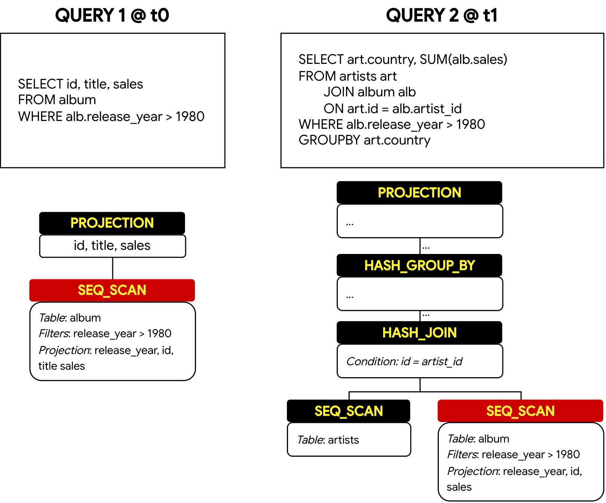

# DSA - Assignment 2

Recent work showed that analytical workloads often have repeating queries: on half of all Amazon Redshift clusters, 80% of queries are repeats of an earlier one. Unfortunately, standard database benchmarks such as TPC-H and TPC-DS contain no repeats.[^1] 
Repeating queries could come from, for example, a dashboard that issues the same or similar queries again, or, more recently, also data agents that incrementally explore a dataset. Consider this trivial example in DuckDB (note that query plans are read bottom-up):

<p align="center">
        
</p>

A naive approach to leverage query reuse (also called "query recycling") would be to materialize (and cache) the result from the SEQ_SCAN on QUERY 1. Then, you might be able to detect that QUERY 2 can use your cached intermediate result rather than executing the operator again. The database system now avoids evaluating the predicate and accessing data from main storage (potentially in the Cloud or on slower units if in-memory DuckDB is not being used).

However, you have to think that this can lead to several downsides:
- Naively materializing all query results will fill your memory fast (the most precious resource for query processing).
- It can also affect query processing: Sometimes DuckDB might avoid full materialization in certain query phases, which might incur slowdowns if you enforce materialization.
- There are many other intricacies with query recycling. Discovering and tackling them is part of your assignment.

Currently, DuckDB is not very optimized for these repeated workloads. It is your job to change that by writing a DuckDB extension! ⚡
[^1]: Saxena et al., [*Why TPC Is Not Enough: An Analysis of the Amazon Redshift Fleet*](https://www.vldb.org/pvldb/vol17/p3694-saxena.pdf), PVLDB 17(11), 2024.

The following literature on query recycling will help you with your assignment. They are ordered by relevance:
- Nagel, F., Boncz, P., & Viglas, S. D. (2013, April). [Recycling in pipelined query evaluation.](https://ieeexplore.ieee.org/stamp/stamp.jsp?arnumber=6544837) In 2013 IEEE 29th International Conference on Data Engineering (ICDE) (pp. 338-349). IEEE.
- Dursun, K., Binnig, C., Çetintemel, U., & Kraska, T. (2017, May). [Revisiting reuse in main memory database systems.](https://dl.acm.org/doi/pdf/10.1145/3035918.3035957) In Proceedings of the 2017 ACM International Conference on Management of Data (pp. 1275-1289).
- Zhou, J., Larson, P. A., Freytag, J. C., & Lehner, W. (2007, June). [Efficient exploitation of similar subexpressions for query processing](https://dl.acm.org/doi/pdf/10.1145/1247480.1247540). In Proceedings of the 2007 ACM SIGMOD international conference on Management of data (pp. 533-544).
- Jindal, A., Karanasos, K., Rao, S., & Patel, H. (2018). [Selecting subexpressions to materialize at datacenter scale](https://alekh.org/papers/p800-jindal.pdf). Proceedings of the VLDB Endowment, 11(7), 800-812.

## Getting started

Press **Use this template → Create a new repository** (top-right of the GitHub page, green button) and set it to **Private**.
Do not fork: a fork of a public repository cannot be made private. Then invite
your team members to it as collaborators.

Clone your repo with its submodules, otherwise it will be missing duckdb and can't test your extension.

```sh
git clone --recurse-submodules https://github.com/<you>/<your-repo>.git
cd <your-repo>
```

**Register your team and install the grader's GitHub App:** 
It will give us read access to each repository it is installed for, so only install it for the repo you want to be graded for. 

```sh
python3 ./scripts/assignment-setup.py
```

The script writes `team.json`, asks when your CI should build, commits both, and opens the grader's GitHub App to install. The App reads every repository it is installed for, so install it only for your assignment repository. 
**We can't evaluate your submission without the App** - there is no separate sign-up.

# Task 

You will be given a stream of SQL queries that are run against the IMDB
database. Your task is to write a DuckDB extension that optimizes the queries.

There is a public and a private query set. The public set is in `benchmark/` of this template and is yours to develop against. The private set is ... private, and will be used for the leaderboard; it uses the similar query patterns, and is what actually ranks you.

Each set is a directory of `.sql` files, **one statement per file**, named `q0000.sql` upwards. They are run **in filename order**, `q0000` first - the order is part of the workload. 

When running the benchmark for the leaderboard, we will use the following settings:
```sql
SET threads = 6;
SET memory_limit = '8000MB';
SET preserve_insertion_order = false;
```

The set runs **twice**. A run scores the **geometric mean** of its query times, and the **faster run counts**.

> [!WARNING]
> **Wrong answers rank before speed.** Every result must match what vanilla DuckDB returns. A run that answers something incorrectly is still timed and still shown on the leaderboard, but the board is sorted by **wrong answers first and time second**: every team that answered the whole set stands above every team that did not, and among those that got something wrong, fewer wrong stands higher.
>
> So no amount of speed buys correctness back - one wrong answer puts you below the slowest team that got them all right. The leaderboard shows how many you got wrong and names the first of them; hovering that tells you why it was rejected. If you have an earlier run that answered everything, that run is the one you are ranked on.

> [!WARNING]
> To accurately measure runtime, **we wrap queries around an `EXPLAIN ANALYZE`**. You must ensure your solution is correct in this scenario.

Grading runs nightly, but **your CI is responsible for building.** The grader benchmarks the binary from your last successful CI build, so the commit it grades is the newest one you have *built* - not necessarily your latest commit. The leaderboard shows which one it used.

No push triggers a build by default: start a build yourself from the Actions tab on the GitHub page (*Run workflow*), or turn on building every push to `main` when running `assignment-setup.py`. A build costs about 33 of the 2000 free Actions minutes a private repository gets per month, so if you want to build every push, make sure your team has enough minutes.

### Download Datasets

The queries in `benchmark/` run against the IMDB (JOB) dataset, which is not in this repository. Download it once:

```sh
python3 ./scripts/download-imdb.py
duckdb data/imdb.duckdb < benchmark/q0000.sql
```

`scripts/imdb_schema.sql` is the schema those queries are written against. It is the same schema that will be used for the leaderboard.

### Building and Testing

```sh
make          # -> build/release/duckdb and build/release/extension/
IMDB_DATA=1 make test     # the SQL tests in test/sql
```

`IMDB_DATA=1 make test` runs `test/sql/benchmark.test`, which loads your extension and runs every query in `benchmark/` against `data/imdb.duckdb`, comparing each result against what vanilla DuckDB returns. `IMDB_DATA=1` prevents the test from running in the CI (as the data is not available there) 

`docs/README.md` is the upstream extension-template documentation - CLion setup, debugging, submodules.


### Benchmarking locally

```sh
make benchmark                                     # the public workload in benchmark/
make benchmark BENCH_ARGS="--runs 3 --slowest 20"  # `--help` lists the flags
```

It prints the total and the geometric mean of each run, and simulates the
evaluator as closely as it can: same binary, same budget, same repeats, same
score. It does not check your answers, and one wrong answer ranks you below
every team that has none - `IMDB_DATA=1 make test` is what checks them.


### What you may and may not change

**We will use DuckDB v1.5.5 to benchmark your extension, so you must build against that version.**

DuckDB is pinned to v1.5.5 by `duckdb_version` in
`.github/workflows/MainDistributionPipeline.yml`, which is what your CI checks the `duckdb/` submodule out to. An extension only loads into the version it was built against, so a binary built against anything else cannot be benchmarked at all.

Please don't rename your extension, as this will (potentially) break the grader.

| File or directory  | What you can do |
|---|---|
| `src/`, `test/` | yours - this is the assignment |
| `benchmark/` | yours to run against locally. The grader benchmarks its own copy, so editing these changes nothing |
| `CMakeLists.txt` | fine to edit to add source files; the change is logged |
| `Makefile`, `extension_config.cmake`, `vcpkg.json` | these feed the **DuckDB** build, not just yours. Changes are flagged for review |
| `.github/workflows/` | how your binary comes to exist. Changing `duckdb_version` or `uses` is flagged, and breaks your submission |
| `duckdb/` | changing it gains you nothing: your extension is benchmarked inside a DuckDB the grader built at the pinned commit, never one from your tree |

### Useful Resources
- A DuckDB extension that **inspects and rewrites a query plan**: https://github.com/Noorts/PDXearch. PDXearch adds Vector Search capabilities to DuckDB. It rewrites a query plan by detecting a certain pattern in it. See [here](https://github.com/Noorts/PDXearch/blob/main/src/index/search/pdxearch_scan_optimizer.cpp#L30) for a fully detailed example. This would be useful if you want to add intermediate steps within a query plan.
- A DuckDB extension that **creates a new operator** `ST_Intersects` to do spatial joins: https://duckdb.org/2025/08/08/spatial-joins, https://github.com/duckdb/duckdb-spatial.
- A DuckDB extension that does Incremental View Maintenance: https://github.com/ila/openivm. Lets you define a materialized view.
- A DuckDB extension that **adds a new scalar function**. This repository is exactly that! It adds an operator named `waddle`.
- DuckDB Extension Development Workshop – Part 1: https://www.youtube.com/watch?v=Lz0E42yQjw8
- DuckDB Extension Development Workshop – Part 2: https://www.youtube.com/watch?v=jo-G2akmjJM

### Troubleshooting

#### 1. `push failed error` in `assignment-setup.py`

Something went wrong while the script tried to push the changes to the repository. Perhaps you have not configured your GitHub credentials or your token has expired / lack permissions.  
**Solution**: Push manually to your repository. Make sure you have a GitHub token that allows workflows execution.

